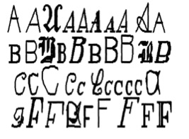

# 1. Introducción

\

- Vimos que la esencia de este método es encontrar un hiperplano separador, tal que los objetos queden separados según sus categorías.

- Todo depende de si los datos son linealmente separables o no; en cada caso cambia la función de optimización.

- Afortunadamente, diversos paquetes de R hacen esto por nosotros.

- Veremos una aplicación de análisis de texto: **reconocimiento óptico de caracteres** (OCR).

- Esto es clave para escanear documentos: necesitamos que la máquina identifique cada letra de un texto físico y la digitalice.

- Es difícil por la cantidad de estilos de letra y fuentes de impresión.

- La idea es convertir patrones de píxeles en letras del alfabeto.

\

# 2. Datos

\

- Al procesar un documento, el software OCR divide el papel en una matriz, y cada celda contiene un único *glyph* (una letra, símbolo o número).

- La idea es asignar a cada *glyph* un carácter. Asumimos que ese proceso ya se hizo: ya tenemos los *glyphs* y sus características.

- Por simplicidad, supondremos que el documento solo contiene caracteres alfabéticos en inglés: queremos asignar a cada *glyph* una de las 26 letras (A--Z).

- Usaremos la base `letterdata.csv`, con 20.000 ejemplos de letras A--Z que varían en su forma de escritura y, por ende, en sus características visuales.

\

**Ejemplo de *glyphs* a clasificar**



\

- Esto es fácil para el cerebro humano, pero difícil para un computador. Exploremos los datos.

- Leemos la base con `stringsAsFactors = TRUE` para que la columna `letter` (el *outcome*) quede como factor:

\

```{r}
letters <- read.csv("data/letterdata.csv", stringsAsFactors = TRUE)
```

\

```{r}
str(letters)
```

\

- Tenemos 20.000 ejemplos y 17 variables. `letter` es la verdadera letra; las 16 restantes son características de los *glyphs* (dimensiones horizontales y verticales, proporción de píxeles negros, posiciones promedio, etc.).

- Las características ya son numéricas, así que no hay que transformarlas. Algunos rangos son grandes y convendría estandarizar, pero el paquete que usaremos lo hace automáticamente.

\

# 3. Entrenamiento del modelo

\

- La base ya viene limpia y en orden aleatorio. Usaremos las primeras 16.000 observaciones (80%) para entrenar y las 4.000 restantes (20%) para probar:

\

```{r}
letters_train <- letters[1:16000, ]
letters_test  <- letters[16001:20000, ]
```

\

- Hay varios paquetes para SVM en R. Usaremos `kernlab` y su función `ksvm()`. Si no lo tienes instalado:

\

```{r, eval=FALSE}
install.packages("kernlab")
```

\

```{r}
library(kernlab)
```

\

- La sintaxis para entrenar es: `m <- ksvm(target ~ predictors, data = mydata, kernel = "rbfdot", C = 1)`, donde:

    - `target` es el *outcome* a predecir y `predictors` las características.
    - `data` es el *data frame*.
    - `kernel` es la función kernel (por defecto, la gaussiana RBF).
    - `C` es el costo de violar las restricciones.

- Empecemos con un **kernel lineal** (`vanilladot`):

\

```{r}
letter_classifier <- ksvm(letter ~ ., data = letters_train, kernel = "vanilladot")
```

\

- Veamos el objeto creado:

\

```{r}
letter_classifier
```

\

# 4. Desempeño del modelo

\

- Probamos la precisión sobre la base de prueba. La sintaxis es `p <- predict(m, test, type = "response")`:

\

```{r}
letter_predictions <- predict(letter_classifier, letters_test)
```

\

- Se crea un vector con la letra predicha para cada uno de los 4.000 *glyphs* de prueba:

\

```{r}
head(letter_predictions)
```

\

- Comparemos predicción contra realidad con una tabla:

\

```{r}
table(letter_predictions, letters_test$letter)
```

\

- Hay errores. Creemos un vector lógico que indique si la letra predicha coincide con la observada:

\

```{r}
agreement <- letter_predictions == letters_test$letter
```

\

```{r}
table(agreement)
prop.table(table(agreement))
```

\

- El modelo lineal acierta alrededor del 84% de las veces. No está mal, pero puede mejorarse.

\

# 5. Mejorando el desempeño del modelo

\

- La elección del kernel es ensayo y error. Usamos uno lineal; probemos uno más flexible, la **gaussiana RBF** (`rbfdot`):

\

```{r}
letter_classifier_rbf <- ksvm(letter ~ ., data = letters_train, kernel = "rbfdot")
```

\

```{r}
letter_predictions_rbf <- predict(letter_classifier_rbf, letters_test)
```

\

```{r}
agreement_rbf <- letter_predictions_rbf == letters_test$letter
prop.table(table(agreement_rbf))
```

\

- La precisión sube a cerca del 93%: una mejora notable solo por cambiar el kernel.

- Como ejercicio, prueba otras funciones kernel o modifica el parámetro `C`.
